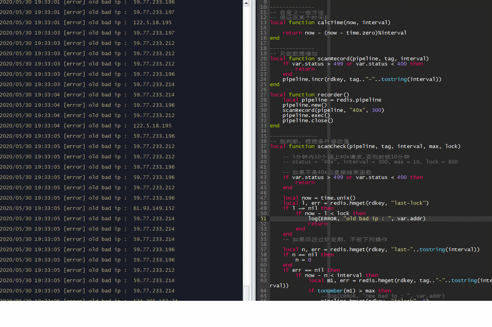
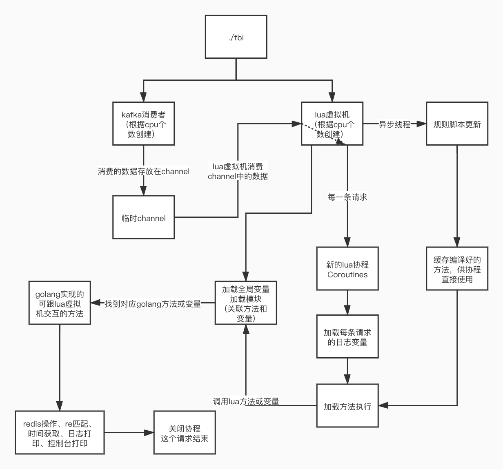
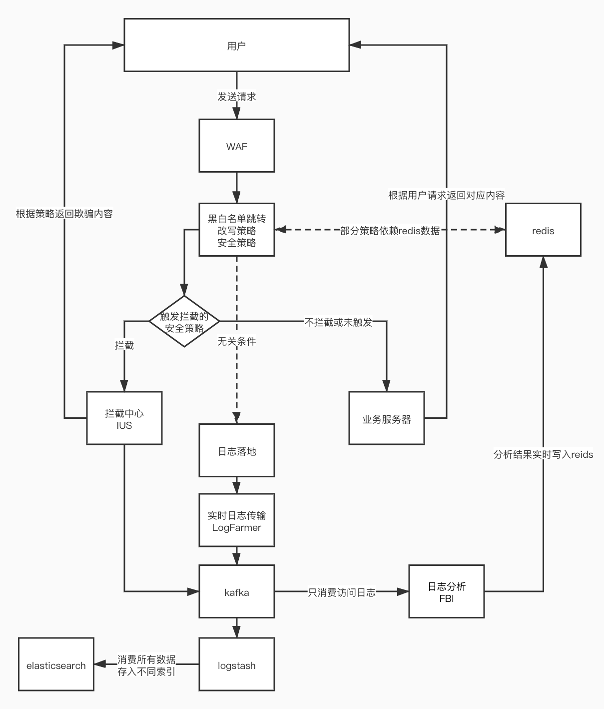

# FBI-Analyzer

FBI-Analyzer是一个灵活的日志分析系统，基于golang和lua，插件风格类似ngx-lua。

使用者只需要编写简单的lua逻辑就可以实现golang能实现的所有需求，[点击](https://github.com/C4o/FBI-Analyzer#%E9%A1%B9%E7%9B%AE%E8%BF%90%E8%A1%8C%E6%B5%81%E7%A8%8B)跳转实现原理。现实中可作为WAF的辅助系统进行安全分析，[点击](https://github.com/C4o/FBI-Analyzer#%E6%9C%AC%E9%A1%B9%E7%9B%AE%E5%9C%A8%E7%8E%B0%E5%AE%9E%E4%B8%AD%E7%9A%84%E5%BA%94%E7%94%A8)跳转实例。

可快速迁移waf中行为分析插件(非实时拦截需求，需要缓存计算数据的逻辑)至本系统，避免插件在处理请求时发起过多对数据缓存(redis等)的请求而导致WAF性能下降，帮助waf减负。

实现这个项目的目的其实也是加深下对lua虚拟机的认识，以及其他语言通过插件的方式调用lua脚本的工作原理，本项目因为只是单纯的lua虚拟机，不是luaJIT，所以不能使用ffi也不能引用三方so的方法。

当然使用lua插件化的性能最佳的语言肯定是C，但是因为太菜了，所以只能以golang来实现，但是就目前观察看下来，处理性能还是可以的。

跳过介绍，使用说明[点击](https://github.com/C4o/FBI-Analyzer#%E9%A1%B9%E7%9B%AE%E8%BF%90%E8%A1%8C%E6%B5%81%E7%A8%8B%E5%92%8C%E6%89%8B%E5%86%8C)跳转。

## 特点

### 插件编写灵活

简单的需求在配置文件中完成其实挺不错的，但是在一些较为复杂的需求面前，配置文件写出来的可能比较抽象，或者说为了简化配置就要为某个单独的需求专门在主项目里写一段专门用来处理的逻辑，可以是可以，但没必要。

在使用openresty一段时间后，发现灵活的插件真的会减轻不少的工作量。接下来基于一个相对复杂的小需求来进行插件编写，[点击](https://github.com/C4o/FBI-Analyzer/blob/master/scripts/counter.lua)跳转插件示例。

```
需求：对5分钟内的访问状态码40x的ip进行针对统计，5分钟内超过100次的打上标签锁定10分钟，供WAF进行拦截。

这种肯定也可以在waf中写插件，但是当类似需求多了，那么一条请求处理就可能会产生多次请求，影响waf性能。
这样的话只让waf发起一条请求读取下分析结果就可以直接进行拦截，将工作量转移给旁路系统，不影响线上服务。
```
### 插件秒级生效

在线上环境运行示例风控插件，能涉及到的业务总QPS高峰大概有十万。(虽然是背着领导偷偷跑的，但是因为完全旁路于业务，所以问题不大。

插件目前使用主动监测的方式进行更新(说白了，for循环)，但是其实可以使用inotify通过修改事件来驱动插件更新，我这里没写是因为我还没写完服务端更新的操作，vim编辑保存文件会删除旧文件创建新文件导致文件监控失败，有点憨批所以没搞。[LogFarmer](https://github.com/C4o/LogFarmer)中实时传日志的方式就是使用事件驱动，实现比较简单。

插件更新时会自动编译缓存，供协程调用，避免每次都会要编译脚本运行。

动图中演示注释和运行打印日志方法来检测插件生效的速度。



### 灵活自定义的函数库

以打印日志为例
```go
func logging(L *lua.LState) int {

	buf := new(bytes.Buffer)
	n := L.GetTop()

	for i := 2; i < n+1; i++ {
		buf.WriteString(L.CheckString(i))
		buf.WriteString(" ")
	}

	logger.Println(L.CheckInt(1), buf.String())
	return 0
}
```

## 已内置的lua函数库和变量

```lua
-- 对于方法的调用，都是通过`.` 而不是`:`
-- 原因在与通过`:`调用方法会默认带和self的table作为第一个参数，所以避免每次调用函数都判断栈顶数据是不是这个table，就只用`.`好了。
-- example
local redis = require("redis")
local ok, err = redis.incr("key", "field")
```

### 内置全局变量

fbi
```lua
-- 项目变量
-- 下面包含var变量，类似openresty
local var = fbi.var
print(var.status) 
-- 项目回显打印 200

-- log方法和log等级参数
local log = fbi.log
local ERROR = fbi.ERROR
local DEBUG = fbi.DEBUG
local INFO = fbi.INFO
log(ERROR, "s1", "s2", "s3", ..., "sn") 
-- 项目日志中打印 [error] s1s2s3...sn

```

```lua
-- 写成lua的table是这样
fbi = {
    var = {
        __metatable = {
            __index = getVarFunctin
        }
    },
    log = logFunction,
    ERROR = level_error,
}
```

### 内置UserData变量

用于在单个lua协程中传递变量

access
```
类型是自定义的access日志GoStruct
```
pipeline
```
类型是redis.pipeliner
```
### 内置模块

redis
```lua
-- 类型都是lua中的类型。ok是bool类型，err是nil或者string类型，result是string或number类型，str是string类型

-- redis单条请求方法
local redis = require("redis")
-- 方法名都和redis方法类似
local result, err = redis.hmget(key, field)
local ok, err = redis.hmset(key, field, value)
local result, err = redis.incr(key, field)
local ok, err = redis.expire(key, second)
local ok, err = redis.delete(key)

-- redis批量请求方法
local redis = require("redis")
local pipeline = redis.pipeline
-- 新建一个pipeline
pipeline.new()
local result, err = pipeline.hmget(key, field)
local ok, err = pipeline.hmset(key, field, value)
local result, err = pipeline.incr(key, field)
local ok, err = pipeline.expire(key, second)
local ok, err = pipeline.delete(key)
local err = pipeline.exec()
pipeline.close()
```
re
```lua
-- 类型都是lua中的类型。ok是bool类型，err是nil或者string类型，str是string类型
-- 项目在定义给lua用的golang正则方法时，缓存了每个待匹配模式，比如"^ab"，提升速度和性能
local re = require("re")
local ok, err = re.match("abcabcd", "^ab")
local str, err = re.find("abcabcd", "^ab") 
```
time
```lua
local time = require("time")
local tu = time.unix() -- 时间戳
local tf = time.format() -- 格式化时间 2020-05-31 00:15
local zero = time.zero -- 1590829200, 基准时间，用于跟当前时间做差取余算时间段
```

## 项目运行流程和手册

### 说明

目前只写了kafka的数据输入，且日志格式为json，后期看情况加。

如需对接自家日志，需要在[rule/struct.go](https://github.com/C4o/FBI-Analyzer/blob/master/rule/struct.go)中定义下日志格式，可以网上找json2gostrcut的转换；再在[lua/http.go](https://github.com/C4o/FBI-Analyzer/blob/master/lua/http.go)对照日志struct进行对应参数对接即可。

```go
type AccessLog struct {
	Host    string  `json:"host"`    // WAF字段，域名
	Status  int     `json:"status"`  // WAF字段，状态码
	XFF     string  `json:"XFF"`     // WAF字段，X-Forwarded-for
	...
}

// 注意下类型就好,lua里面数字都是number类型。
func GetReqVar(L *lua.LState) int {

	access := L.GetGlobal("access").(*lua.LUserData).Value.(*rule.AccessLog)
	_ = L.CheckAny(1)
	switch L.CheckString(2) {
	case "host":
		L.Push(lua.LString(access.Host))
	case "status":
		L.Push(lua.LNumber(access.Status))
	case "XFF":
		L.Push(lua.LString(access.XFF))
	...
	default:
		L.Push(lua.LNil)
}	
```

初次使用可通过打印一些变量来测试，例如
```lua
local var = fbi.var
local log = fbi.log
local ERROR = fbi.ERROR

log(ERROR, "status is ", tostring(var.status), ", req is ", var.host, var,uri, "?", var.query)
-- 可能输出 [error] status is 200, req is www.test.com/path/a?id=1
```

### 项目运行流程



### 安装

```
按照go.mod里的配置就行

kafka三方库需要安装librdkafka，参照
https://github.com/confluentinc/confluent-kafka-go#installing-librdkafka

redis三方库前几天刚更新，每个执行函数的参数都加了个ctx，如果不会改的话，go get 7.3版本即可
https://github.com/go-redis/redis/tree/v7
```

### 现阶段软件配置

日志源：Kafka

数据缓存：Redis

### 配置文件样例

```yaml
# redis配置
redis: "127.0.0.1:6379"
password: ""
db: 9
# kafka配置
broker: 192.168.1.1:9092
groupid: group-access-test-v1
topic: 
- waflog
offset: latest
# 项目日志配置
path: Analyzer.log
```

### 使用方式

```
git clone https://github.com/C4o/FBI-Analyzer
go build main.go
./main
```

1.如果没有redis和kafka，没有关系，修改main.go的最后几行即可。通过print或log方法进行输出。

原始代码
```go
    // 初始化redis,连接和健康检查
	red := db.Redis{
		RedisAddr: conf.Cfg.RedAddr,
		RedisPass: conf.Cfg.RedPass,
		RedisDB:   conf.Cfg.DB,
	}
    // 初始化kafka配置
	kaf := db.Kafka{
		Broker:  conf.Cfg.Broker,
		GroupID: conf.Cfg.GroupID,
		Topic:   conf.Cfg.Topic,
		Offset:  conf.Cfg.Offset,
	}
	// 启动lua进程
	for i := 0; i < runtime.NumCPU(); i++ {
		go lua.LuaThread(i)
		go kaf.Consumer(lua.Kchan, i)
	}
	// 本地模拟消费者，不使用kafka
	//go lua.TestConsumer()
	// redis健康检查卡住主进程，redis异常断开程序终止
	red.Health()
```
更新代码
```go
    // 初始化redis,连接和健康检查
	//red := db.Redis{
	//	RedisAddr: conf.Cfg.RedAddr,
	//	RedisPass: conf.Cfg.RedPass,
	//	RedisDB:   conf.Cfg.DB,
	//}
    // 初始化kafka配置
	//kaf := db.Kafka{
	//Broker:  conf.Cfg.Broker,
	//GroupID: conf.Cfg.GroupID,
	//Topic:   conf.Cfg.Topic,
	//Offset:  conf.Cfg.Offset,
	//}
	// 启动lua进程
	for i := 0; i < runtime.NumCPU(); i++ {
		go lua.LuaThread(i)
		//go kaf.Consumer(lua.Kchan, i)
	}
	// 本地模拟消费者，不使用kafka
	lua.TestConsumer()
	// redis健康检查卡住主进程，redis异常断开程序终止
	// red.Health()
```

2.如果模块或参数使用不对，可在日志中查看lua脚本哪一行报错。

```
[root@localhost FBI-Analyzer]# cat Analyzer.log | grep "#" | head -n 5
2020/05/27 13:28:21 [error] Consumer error: 10.205.241.146:9092/bootstrap: Connect to ipv4#10.205.241.146:9092 failed: No route to host (after 4ms in state CONNECT) (<nil>)
2020/05/27 13:41:44 [error] coroutines failed : scripts/counter.lua:5: bad argument #3 to incr (value expected).
2020/05/27 13:41:49 [error] coroutines failed : scripts/counter.lua:5: bad argument #3 to incr (value expected).
2020/05/27 13:41:54 [error] coroutines failed : scripts/counter.lua:5: bad argument #3 to incr (value expected).
2020/05/27 13:41:59 [error] coroutines failed : scripts/counter.lua:5: bad argument #3 to incr (value expected).
```

## 本项目在现实中的应用

### WAF体系


### 拦截中心
项目地址：https://github.com/C4o/IUS

### 实时日志传输模块
项目地址：https://github.com/C4o/LogFarmer 
